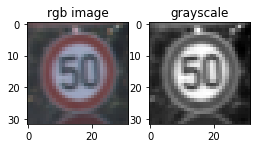

#**Traffic Sign Recognition** 

**Build a Traffic Sign Recognition Project**

The goals / steps of this project are the following:
* Load the data set (see below for links to the project data set)
* Explore, summarize and visualize the data set
* Design, train and test a model architecture
* Use the model to make predictions on new images
* Analyze the softmax probabilities of the new images
* Summarize the results with a written report

[//]: # (Image References)

[image1]: ./examples/visualization.jpg "Visualization"
[image2]: ./examples/grayscale.jpg "Grayscaling"
[image3]: ./examples/random_noise.jpg "Random Noise"
[image4]: ./examples/placeholder.png "Traffic Sign 1"
[image5]: ./examples/placeholder.png "Traffic Sign 2"
[image6]: ./examples/placeholder.png "Traffic Sign 3"
[image7]: ./examples/placeholder.png "Traffic Sign 4"
[image8]: ./examples/placeholder.png "Traffic Sign 5"

## Rubric Points
###Here I will consider the [rubric points](https://review.udacity.com/#!/rubrics/481/view) individually and describe how I addressed each point in my implementation.  

---
###Writeup / README

###Data Set Summary & Exploration
Dataset used: **German Traffic Sign Dataset** [GTSRD]
Used the pandas library to calculate summary statistics of the traffic signs data set:

* The size of training set is:     images = (34799,32,32,3) and # of classes = 43
* The size of the validation set:  images = (4410,32,32,3)  and # of classes = 43
* The size of test set:            images = (12630,32,32,3) and # of classes = 43
* The shape of a traffic sign image: 32x32x3 (RGB image)
* The number of unique classes/labels in the data set: 43

####2. Include an exploratory visualization of the dataset.

Here is an exploratory visualization of the data set. It is a histogram plot showing the 
the number of images/class in each of the image sets (Training, Validation and Test sets).
As we can see the data set distribution is not uniform among the different classes which
could cause detection of certain type of images difficult. Ideally uniform dataset with
Normalized image data would help to train the Network.

###Design and Test a Model Architecture

###1. Preprocessing of the Input Image data
- The Input image data from Dataset is in color RGB format and are converted to Gray scale images
using the luminosity method (taking sum-product of the RGB values of the pixel with [0.299, 0.587, 0.114])
This is achieved using numpy.dot method. The Grayscale images seems to enable the training due to increased
brightness/contrast and reduced noise of the image and also as the input/initial layer of the ConvNet
known to be activated by simple features like lines, edges ad blobs.

- Also the pixel values are  Normalized to have a mean of 0 and standard deviation of 1 (using the
normalization factor of 128. normalized pixel = (pixel - 128/128)) and pixel values have range [-1,1).
This would help so that the features (weights/biases) do not go out of bounds during backprop.

- Additional data: As the data distribution seems to be non-uniform, adding additional images to
data set for those images that are low in number would help in training of the network.
Images could be altered versions of original image(s) with additional noise (pixel shifts +/-2),
little rotational transformations, brightness/contrast change, etc. But this has not been done here 
(in interest of time) and would have achieved better results.

###2. Description of the Network Model.

My final model consisted of the following layers: 

| Layer         	    |     Description	        					| 
|:---------------------:|:---------------------------------------------:| 
| Input         		| 32x32x1 Grayscale Normalized image			| 
| Convolution1 5x5     	| 1x1 stride, VALID padding, outputs 28x28x12 	|
| RELU					|												|
| Max pooling1	      	| 2x2 stride,  outputs 14x14x16 				|
| Convolution2 5x5     	| 1x1 stride, VALID padding, outputs 10x10x16 	|
| RELU					|												|
| Max pooling2	      	| 2x2 stride,  outputs 5x5x16    				|
| Fully connected		| 400x120     									|
| Fully connected		| 120x84     									|
| Fully connected		| 84x43     									|
| Softmax				| Classifier   									|
|						|												|
|						|												|
 

####3. Training the Model. 

This is base model from the popular Lenet architecture and the implementation is in Tensorflow
The model is trained using the AdamOptimizer with a batch size of 128 and number of epochs = 50. 
And the learning parameter has been set at 0.001. 

####4. Approach to get required Validation accuracy

The LeNet architecture is one of the preliminary architecture to perform well for image classification problem.
The model is based on the popular Lenet architecture and initially trained the model as-is using the RGB input images
to see the base performance and it was not optimal as expected. Then RGB images were converted to Grayscale images
(with Normalization) and used as input and it improved the result of validation accuracy from 0.89 to 0.92
for the given hyperparameters. In order to extract the initial layer activations grayscale images that emphasize
edges and have better noise characteristics compared to RGB images. 
Also the hyperparameters of the ConvNet have been changed like the number of feature maps at the initial stages
as depth of first layer set to 6,8,12 and depth = 12 seems to produce better results as they seem to capture
the different type of features (even randomly initialized).
Also trained the network with different epochs to achieve the required Validation accuracy and epoch > 35
seems to have achieved required result as training accuracy increased along with validation accuracy.

My final model results were:
* training set accuracy of 0.998
* validation set accuracy of 0.94
* test set accuracy of 0.93

The well known architecture LeNet was chosen as starting point as it was a simple and proven architecture
for image classification problem. And as traffic sign application required detecting of images that might have
certain changes in image orientation/image noise levels etc. that were well handled by certain modifications of
LeNet architecture which was demonstrated later on. After pre-processing of input images and modification of
hyper parameters to train the model, the training accuracy along with Validation and test accuaracies
showed that model was not showing overfitting(high variance) as training accuracy increased the validation 
and test accuracies also showed simultaneous improvement. And also showed no signs of underfitting issues 
(high bias) as training, validation and test accuracy are high enough. 
 

###Test a Model on New Images

####1. Test images from Web

Here are five German traffic signs (from web) used for testing the model:

 

 
 

The images are of different resolution and there are some additional structures/text in some images and this
would be a good test for the model to predict the signs.
The first image (speed-sign) seems to occupy major area/portion of the image and was detected well
with prediction probablity. 
The second image was difficult for the model to predict as the symbol sign was smaller portion of the image
with additional features in the image like the pole and tree in background.
Third image was of Pedestrain crossing, that again had same issue as second image(sign was smaller portion
of the image) with additional text.
Fourth and fifth images were cropped just to have traffic signs with good image contrast and were predicted correctly.

####2. Discuss the model's predictions on these new traffic signs and compare the results to predicting on the test set. At a minimum, discuss what the predictions were, the accuracy on these new predictions, and compare the accuracy to the accuracy on the test set (OPTIONAL: Discuss the results in more detail as described in the "Stand Out Suggestions" part of the rubric).

Here are the results of the prediction:

| Image			        |     Prediction	        					| 
|:---------------------:|:---------------------------------------------:| 
| Speed Limit(30)   	| Speed Limit(30)   							| 
| Pedestrains 			| General Caution								|
| Children Crossing		| Slippery Road									|
| Bicycle crossing 		| Bicycle crossing  			 				|
| Wild animals crossing	| Wild animals crossing							|

The model was able to correctly guess 3 of the 5 traffic signs, which gives an accuracy of 60%. 
This compares favorably to the accuracy on the test set of traffic signs

####3. Predictions for test images (softmax probabilities for each prediction). 
The code for making predictions on my final model is located in the 13th cell of the Ipython notebook.

Here are the probabilities for the five images, the probabilities were very high compared to other
images/classes that shows that network has feature maps trained with high weight and bias values
for certain layers. Network could be trained with additional images with different variations.

| Probability         	|     Prediction	        					| 
|:---------------------:|:---------------------------------------------:| 
| 1.0               	| Speed Limit(30)   							| 
| 1.0               	| General Caution								|
| 0.99               	| Slippery Road									|
| 1.0               	| Bicycle crossing  			 				|
| 1.0               	| Wild animals crossing							|

